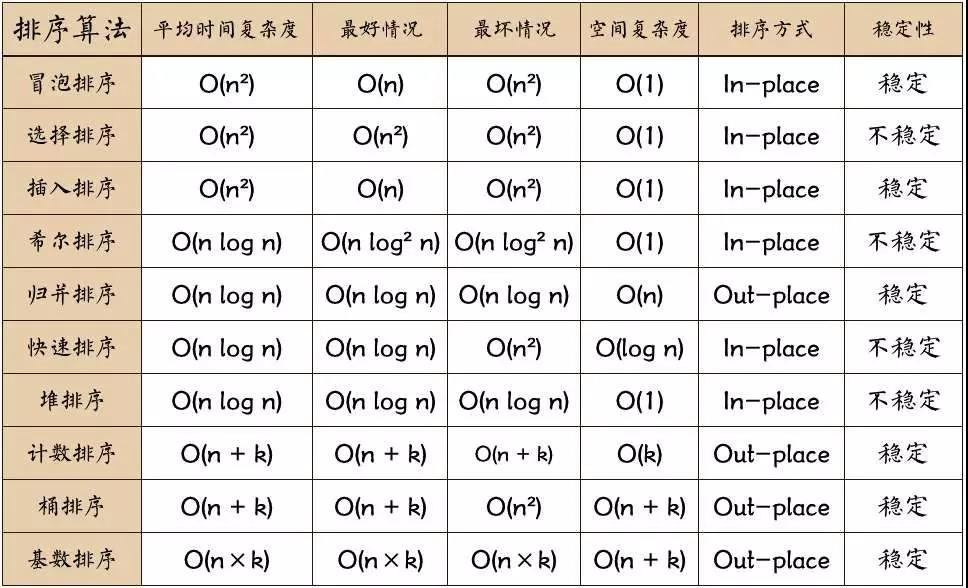

## 十大排序算法

### 选择排序

思想：每次选择**剩下的**最大/最小的元素，放在最前面/最后面

### 插入排序

思想：选择一个元素，在它前面**已排好序的数组中寻找插入位置**，插入这个元素

### 冒泡排序

思想：**两两对比交换**，每一趟找到最大/最小值

### 希尔排序

**插入排序的优化**：无论是插入排序还是冒泡排序，如果数组的最大值刚好是在第一位，要将它挪到正确的位置就需要 n - 1 次移动。也就是说，原数组的一个元素如果距离它正确的位置很远的话，则需要与相邻元素交换很多次才能到达正确的位置

思想：通过不断**缩小间隔h**来实现数组的**局部排序**，知道h为1排序完毕

### 归并排序

思想：递归**拆分**数组，对两段已经排序好的数组进行**合并**。

### 快速排序

思想：找到一个**基数值/中轴值**，将小于该值的元素放在该值左边，大于该值的元素放在该值右边，保证**这个元素在数组中的顺序是确定的**。

### 堆排序

思想：通过**建立大顶堆/小顶堆**，建堆之后的数组就是排序好的数组

### 计数排序

思想：用一个**大数组记录每个元素出现的次数**，即arr[i]  = n表示元素i出现了n次，记录次数的过程中也排好了序

**适用场景**：整数元素且最大最小值相差不大

### 桶排序

思想：与技术排序类似，**根据数组元素的值分布区间分为一个个的桶**，把符合条件的元素入桶，只**对桶内元素进行排序**（快排/归并）。

**适用场景**：在元素分布均匀的情况下，时间复杂度很好，接近O(n)，但是不均匀情况时间复杂度就较差并且浪费较多空间。

### 基数排序

思路：根据整数数值分为十个桶（桶排序变种），先按元素的个位数入桶排序，再按十位数，百位数。。。。最终取出的就是排好序的数组

**适用场景**：整数，且数值较小

### 特点



**总结**

最好情况下(有序数组)，时间复杂度最好的算法是冒泡排序(优化)

不稳定排序：选择，希尔，快速，堆排

## 优先队列

优先队列是一种以大/小根堆为基础的数据结构，每次在队尾插入或队头弹出值时，都会调整队列元素，保证每次队头元素都是队列内最大/最小元素（大小根堆）。

**适用场景**：根据任务优先级执行任务，堆排序，数据流的中位数

**代码实现**

```js

//优先队列算法
class MyPriorityHeap{
    constructor(isAsc = false){
        this.heap = [];
        this.isAsc = isAsc;//大顶堆/小顶堆，默认大顶堆
        this.compare = (a, b) => (this.isAsc? a < b : a > b); // 封装比较逻辑
    }
    getSize(){
        return this.heap.length;
    }
    //向队列插入元素
    //插入到队尾，因此需要上浮调整
    push(num){
        this.heap.push(num);
        this.upHeapify(this.getSize()-1);
    }
    //弹出队头最大/最小元素
    //队头出队，需要下沉调整
    pop(){
        if(this.getSize() == 0)return undefined;
        if(this.getSize() === 1)return this.heap.pop();

        let top = this.heap[0];
        this.heap[0] = this.heap.pop();//代替shift操作避免数组移动，提高效率
        //向下堆化
        this.downHeapify(0);
        return top;
    }
    //下沉（从下往上调整）
    downHeapify = (target) => {
        let extreme = target;//交换的索引

        const left = 2 * target + 1; // 左子节点
        const right = 2 * target + 2; // 右子节点
        
        const heapSize = this.getSize();
    
        if (left < heapSize && this.compare(this.heap[left], this.heap[extreme])) {
            extreme = left;
        }
        if (right < heapSize && this.compare(this.heap[right], this.heap[extreme])) {
            extreme = right;
        }
        
        // 只有在需要交换时才进行操作
        if (extreme !== target) {
            [this.heap[target], this.heap[extreme]] = [this.heap[extreme], this.heap[target]];
            this.downHeapify(extreme); // 有交换，可能影响上一层，递归调整
        }
    }
    //上浮（从下往上调整）
    upHeapify = (target) => {
        if (target <= 0) return; // 终止条件

        const parent = Math.floor((target - 1) / 2);//父节点
 
        if (this.compare(this.heap[target], this.heap[parent])) {
            [this.heap[target], this.heap[parent]] = [this.heap[parent], this.heap[target]];
            this.upHeapify(parent); // 递归调整
        }
    }
}

```

