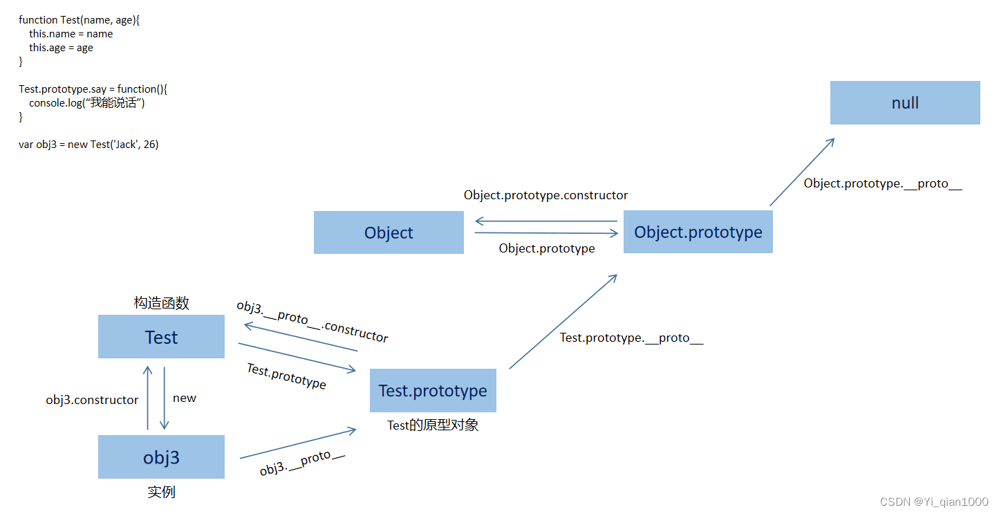

# ES6

## 新特性

let,const 变量

解构赋值

...扩展语法（展开运算符）

类class

promise

模板字符串(`${}`)

剩余参数（...args）

模块化（import export）

symbol

迭代器和生成器

map/set

## Generator

生成器，ES6提出的异步编程解决方案，特点：**可以随时暂停函数的执行并且在任意时刻开始函数的执行**

语法：

```js
//多一个*
function* myGenerator(){
    console.log(1);
    //yield关键字
    const a = yield getData();
    console.log(2);
}
const fnG = myGenerator();//调用返回一个迭代器对象
let {value,done} = fnG.next();//调用next()方法开始执行，知道yield关键字暂停，直到下一个next函数调用
//next函数返回{value,next},value是值yield后面的内容，这里指的是getData函数，done：boolean当为true时代表整个函数已经执行完全，没有yield了
//next(arg),将参数传递给上一次停下来的地方，这里会传给const a;

//终止生成器
fnG.return();//直接终止，后面的yield不执行，done为true
fnG.throw();//抛出异常停止后面的执行,done也是true
```


## let、const、var区别

### var

var会有变量提升，即不管声明在何处，运行时都会提升到作用域的顶部

```js
console.log(a);//输出的是undefined
var a = 999
//为啥不是a未定义？
//因为var a这句话提升到最顶部了
//为啥不是999？
//只提升了var a,a=999的赋值操作还没有跑到
//总结：var a = 999是拆分成了声明和赋值两个部分，声明被状态提升到当前作用域顶部
```

var在函数内声明，就是局部变量，在函数外声明，就是全局变量

```js
var x = 1;
function test() {
  var x = 2;
  console.log(x); // 输出2
}
test();
console.log(x); // 输出1
```

### let、const

存在**暂时性死区**

即在变量声明之前，不能使用

## 函数提升

分为两种

```js
//function直接声明函数，提升到顶层
foo();  // foo2
function foo() {
    console.log('foo2');
}
//以变量赋值的形式---->走变量提升的逻辑
console.log(bar);//undefined
bar();//not a function
var bar = function(){console.log("bar")}
```

时序：**在一个作用域中，先处理函数声明、再处理变量声明，但是两者的优先级依旧低于执行定义语句。**

```js
var foo = 1;
console.log(foo);//1
function foo(){
    console.log("foo"); 
};
```

## 深浅拷贝

**浅拷贝**是创建一个新对象，这个对象有着原始对象属性值的一份精确拷贝。如果属性是基本类型，拷贝的就是基本类型的值，如果属性是引用类型，拷贝的就是内存地址 ，所以如果其中一个对象改变了这个地址，就会影响到另一个对象。**！！！浅拷贝不只是拿到引用**
**深拷贝**是将一个对象从内存中完整的拷贝一份出来,从堆内存中开辟一个新的区域存放新对象,且修改新对象不会影响原对象。

###  常见浅拷贝方法

- Object.assign()

  Object.assign()不会拷贝对象的继承属性；
  Object.assign()不会拷贝对象的不可枚举的属性；
  Object.assign()可以拷贝 Symbol 类型的属性。

- 扩展运算符(…)

- Array.prototype.concat()

- Array.slice()//实现数组分割，但是不传值的话就是整个浅拷贝

## 箭头函数与普通函数的区别

1.语法简洁性

2.this指向不同

​	箭头函数没有自己的this，指向外层的this。

​	普通函数的this由调用时确定，指向调用它的对象。

​	箭头函数无法通过this,call,bind改变this指向

3.箭头函数不能作为构造函数

4.箭头函数没有arguments对象

## 变量的解构赋值

## promise、async await、Generator的区别

## Promise.resolve()的用法

```js
Promise.reslove(value);//无参数或参数为普通值时，返回一个值为value的resolve状态
Promise.resolve(thenable);//参数是thenable对象(具有then方法的对象)时，会将这个对象转为promise对象（主要用法）
Promise.resolve(promise);//参数是promise对象时，原封不动返回
```

## Promise.try()的用法和使用场景

场景：当一个函数不好判断是同步/异步函数时或开发者不想判断时，但又想要在函数执行完成后使用then处理接下来的逻辑，这个时候就可以用Promise.resolve(fn).then(()=>{})或Promise.try().then(()=>{})

```js
//对比
//resolve形式的缺点，包装为Promise对象，因此，如果函数是同步函数，也会被变成异步函数进入微任务队列中，执行时机在本轮事件循环的同步代码之后，不是立即执行
//当函数内部抛出异常时，捕获不到并且没有返回状态
Promise.resolve(fn).then(()=>{})
//try，函数立即执行，能捕获到函数内部的异常
Promise.try().then(()=>{})
```


## ES6的继承与ES5相比有什么不同

1. ES5 的继承实质上是先创建子类的实例对象， 然后再将父类的方法添加
   到 this 上（Parent.apply(this)） .

2. ES6 的继承机制完全不同， 实质上是先创建父类的实例对象 this（所以必
   须先调用父类的 super()方法） ， 然后再用子类的构造函数修改 this。

3. ES5 的继承时通过原型或构造函数机制来实现。

4. ES6 通过 class 关键字定义类， 里面有构造方法， 类之间通过 extends 关
   键字实现继承。

5. 子类必须在 constructor 方法中调用 super 方法， 否则新建实例报错。 因
   为子类没有自己的 this 对象， 而是继承了父类的 this 对象， 然后对其进行加工。
   如果不调用 super 方法， 子类得不到 this 对象。

6. 注意 super 关键字指代父类的实例， 即父类的 this 对象。

7. 注意： 在子类构造函数中， 调用 super 后， 才可使用 this 关键字， 否则
   报错。

   ```js
   //ES5继承
       function Person(name){//父类构造方法
         this.name = name
       }
       Person.prototype.getName = function(){//父类原型链新增方法
         return this.name
       }
       function Student(){//子类构造方法
         Person.apply(this , arguments)//将父类方法加到子类实例
       }
       Student.prototype = Object.create(Person.prototype)//修改子类的原型对象
       Student.prototype.constructor = Student;//上面会改变构造函数，所以再改回来，指向自己的构造函数
   
   ```

   

## js模块化（commonjs/AMD/CMD/ES6）

## 回调地狱，如何解决

回调地狱：回调函数中嵌套回调函数

多数在写阻塞执行代码的时候会产生，为了保证异步代码的时序性，通常会在一个异步代码的回调函数中嵌入其它回调函数

```js
 //地狱回调
//问题：导致代码可读性差，不方便维护
setTimeout(function () {  //第一层
    console.log('张三');//等3秒打印张三在执行下一个回调函数
    setTimeout(function () {  //第二层
        console.log('李四');//等2秒打印李四在执行下一个回调函数
        setTimeout(function () {   //第三层
            console.log('王五');//等一秒打印王五
        }, 1000)
    }, 2000)
}, 3000)
```

解决：Promise或async/await

## 原型链！！

1，在js中，每一个对象（函数也是对象）都有一个特殊的属性叫做**原型（prorotype）**，它指向另一个对象，这个对象被称为原型对象， ***原型对象是用来共享属性和方法***的

2，对象有一个属性(__proto__)指向构造函数的原型对象，构造函数的原型对象也存在__proto__

3，原型链的顶端是Object.prototype

4，原型链的终点是null



```js
class Cat extends Animal{}
let cat = new Cat()
cat.__proto__ === Cat.prototype
Cat.prototype.__proto__ === Animal.prototype
Animal.prototype.__proto__ === Object.prototype ===null
//得出下面的原型链
cat.__proto__.__proto__.__proto__=null
```

每个对象都有一个原型(prototype),它指向另外一个对象，而指向的对象又存在属性(_proto_)指向另外一个对象。当我们访问对象(obj3)的属性时，会先在对象定义的属性中进行查找，没找到就会沿着__proto__一路向上查找，最终形成一个链式结构，这整个链式结构就叫做原型链
**__proto__存在的意义在于为原型链查找提供方向，原型链查找靠的是__proto__，而不是prototype**

