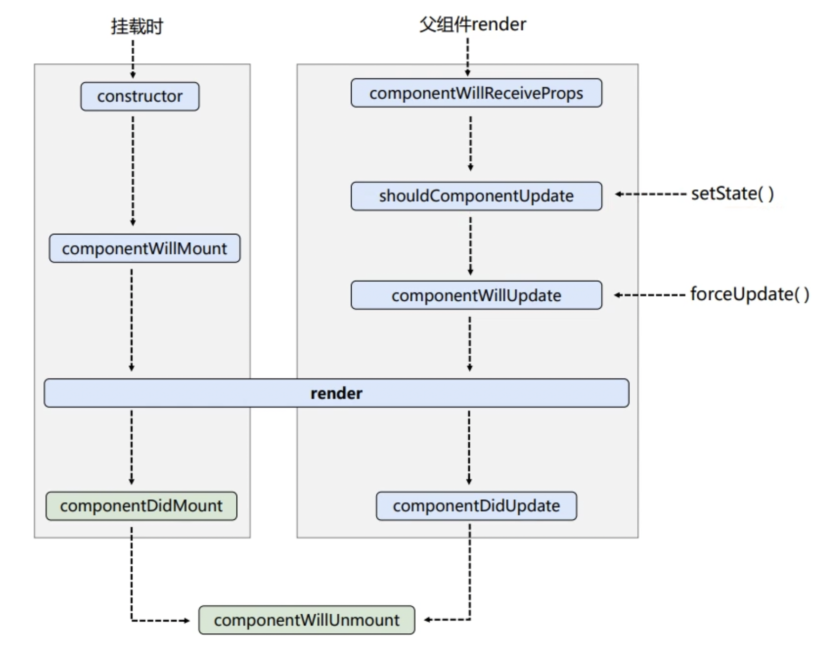
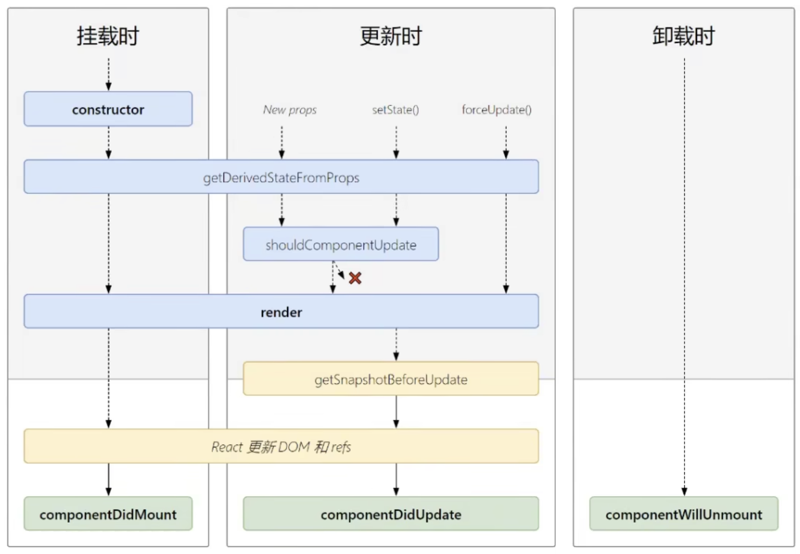
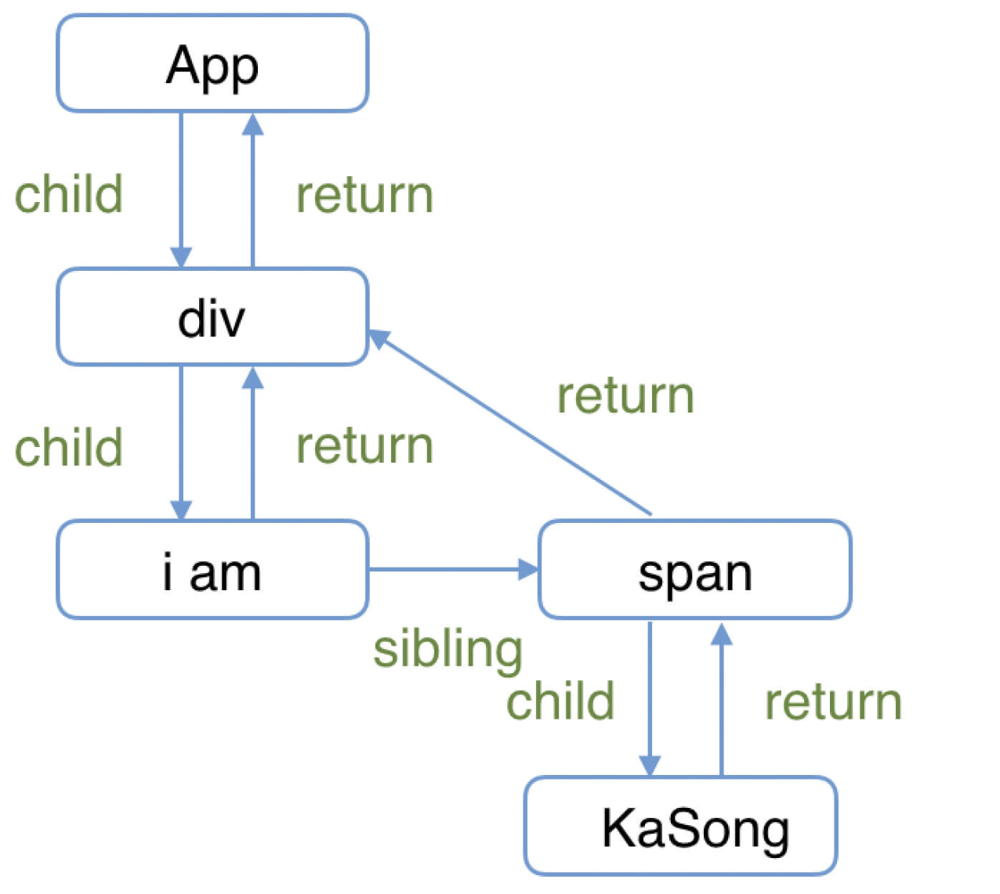

## Hooks是什么

Hooks 是 React 16.8 版本引入的一项特性，它**允许在函数式组件中使用状态和其他 React 特性**，而不需要使用类组件。Hooks 就是钩子，作用是把某个目标结果钩到某个可能会变化的数据源或者事件源上，那么当被钩到的数据或事件发生变化时，产生这个目标结果的代码会重新执行，产生更新后的结果。

## React常用钩子

### useState

控制响应式状态

```js
const [count,setCount] = useState(0)
```

### useEffect

副作用函数，用于执行React执行时的副作用操作(发起网络请求，启动定时器，手动修改DOM)

一般用来实现，组件的生命周期，组件的监视属性

```js
useEffect(callback,[dependArray]);
//callback,每次执行时的回调，可以返回一个函数，该函数会在组件卸载前执行（实现componentWillUnmount）
//dependArray依赖数组
//不写dependArray,监测所有state,其中一个变化就会触发函数
//dependArray = [],谁也不监测,但会在组件挂载完成之后执行一次（实现componentMounted）
```

### useRef

用于创建一个对象用于保存和访问可变的ref对象

```js
const myButton = useRef(null);//初始化为null
console.log(myButtom.current);//目标dom
```

### useMemo

用于缓存和重用计算成本高的值，用于提升性能，类似于watch监视属性(实现shouldComponentUpdate)

```js
 let result = useMemo(() => {
    return comuteData()
  }, [size])//size改变才会更新result
```

### useCallback

类似于useMemo，不过useCallback是用来缓存回调函数的，以便在依赖项变化时避免不必要的函数重新创建

```js
  const handleClick = useCallback(() => {
    	// 处理点击事件逻辑
          setCount(count+1)
  },[size])
  //由于useCallback返回的是一个函数，因此，你甚至可以用它来返回一个子函数组件
  //优点：可以避免父组件每次更新时都重新渲染这个组件
```

### useContext

创建状态上下文，用于在多层嵌套的组件中传递数据

### useReducer

`useReducer` 是 `useState` 的替代方案。它接收一个形如 `(state, action) => newState 的 reducer`，并返回当前的 state 以及与其配套的 `dispatch` 方法。

当状态更新逻辑较复杂时可以考虑使用 useReducer。useReducer 可以同时更新多个状态，而且能把对状态的修改从组件中独立出来。

相比于 useState，useReducer 可以更好的描述“如何更新状态”。例如：组件负责发出行为，useReducer 负责更新状态。

好处是：**让代码逻辑更清晰，代码行为更易预测。**

```js
const [state, dispatch] = useReducer(reducer, initState, initAction?)//initAction:state初始化处理函数
const reducer = (state, action) => {
  switch (action.type) {
    case 'count':
      return { ...state, count: state.count + 1 }
    default:
      return state
  }
}
const [useState, dispatch] = useReducer(reducer, { count: 0 })                                 
dispatch({type:count})//修改状态
```

## 多层级组件设计思路

**需求**：改善多层props传递时导致的一些中间组件无意义重渲染

### 组件UI层面

使用Context定义上下文/状态管理工具

### 代码逻辑层面

1. **组件职责单一**：确保每个组件专注于单一功能，减少组件间状态依赖依赖。
2. **状态提升**：将低级组件依赖的状态提升到高级组件，中间组件只协助传递不使用。
3. **自定义 Hooks**：封装复杂的逻辑，便于复用。
4. **按功能划分组件**：模块化功能，提高代码可维护性。
5. **性能优化**：使用 `React.memo` 和 `useCallback` 避免不必要的重新渲染。

### useRef细节

useRef 返回一个可变的 ref 对象，其内部只有一个 current 属性被初始化为传入的参数（initialValue）
**useRef 返回的 ref 对象在组件的整个生命周期内持续存在**
**更新 current 值时并不会触发页面的重新渲染（re-render）**
useRef 会在每次渲染时返回同一个 ref 对象
本质上，useRef 就像是可以在其 .current 属性中保存一个可变值的“盒子”。

因此，Ref不仅可以用来存放元素ref，还可以用来跨渲染周期保存对象。

### 应用场景

**实现useEffect的对象监听**

使用useRef保存上一次渲染周期的监听对象，和当前对象深对比，实现useEffecr监听对象

（useEffect监视对象引用时会无限触发，因为每一次渲染都会重新创建对象，每次的引用都不同）

```js
import { isEqual } from 'lodash';//使用lodash库的深比较
const useCampare = (value: any, compare: any) => {
  const ref = useRef<any>(null);
  if (!compare(value, ref.current)) {  // deep compare
    ref.current = value;
  }
  return ref.current;
}
const compareObject = useCampare(object, isEqual);
useEffect(() => {
  ...
}, [compareObject]);
```

### 优化重复的网络请求

```js
 const [data, setData] = useState(null);
  const hasFetched = useRef(false); // 用于跟踪请求是否已经发出过，或者跟踪请求参数是否改变

  useEffect(() => {
    if (hasFetched.current) return; // 如果请求已发出，则不再发出新的请求

    const fetchData = async () => {
      try {
        const response = await axios.get('https://api.example.com/data');
        setData(response.data);
        hasFetched.current = true; // 标记请求已发出
      } catch (error) {
        console.error('请求失败', error);
      }
    };

    fetchData();
```

## React18更新内容/新特性

### 并发渲染

新的底层渲染机制，使得React能够同时准备多个版本的UI。

在18之前，采用同步渲染，即一旦渲染无法中断，直到用户看到渲染结果。

而并发渲染的关键特性：**渲染可中断**，随时可以开启，挂起，继续一个渲染任务。这样做，React 就可以在后台提前准备新的屏幕内容，而不阻塞主线程。这意味着用户输入可以被立即响应，即使存在大量渲染任务，也能有流畅的用户体验。

### 自动批处理

在React18之前，自动批处理只存在于**合成事件**处理程序中，即点击事件之后触发的**回调中有多个setState动作，只会触发一次渲染**

But，在Promise和setTimeout定时器中，默认不会开启这样的机制

```js
// 以前: 只有 React 事件会被批处理。
setTimeout(() => {
  setCount(c => c + 1);
  setFlag(f => !f);
  // React 会渲染两次，每次更新一个状态（没有批处理）
}, 1000);

// 现在: 超时，promise，本机事件处理程序
// 原生应用时间处理程序或者任何其他时间都被批处理了
setTimeout(() => {
  setCount(c => c + 1);
  setFlag(f => !f);
  // 最终，React 将仅会重新渲染一次（这就是批处理！）
}, 1000);
```

### 过渡更新（实现并发渲染）

- `useTransition`： 一个用于开启过渡更新的 Hook，用于跟踪待定转场状态。
- `startTransition`： 当 Hook 不能使用时，用于开启过渡的方法。

```js
import { startTransition } from 'react';

// 紧急更新: 显示输入的内容
setInputValue(input);

// 将任何内部的状态更新都标记为过渡更新
startTransition(() => {
  // 过渡更新: 展示结果
  setSearchQuery(input);
});
```

### 新的Suspence特性

支持服务端 Suspense，并且使用并发渲染特性扩展了其功能。

### 新的渲染API

### 新的严格模式

React 18 为严格模式下的开发环境引入了一个新的检查机制。每当组件第一次挂载时，这个检查机制将自动卸载又重新挂载每个组件，并在第二次挂载时复用先前的状态。

这**允许 React 在保留状态的同时添加和移除 UI。**

### 新的Hook

useId,useTransition,useDeferredValue,useSyncExternalStore,useInsertionEffect

## React如何引入CSS

### 使用行内样式

```jsx
//驼峰命名法
const div1 = {
 width: "300px",
 margin: "30px auto",
 backgroundColor: "#44014C", 
 minHeight: "200px",
 boxSizing: "border-box"
};
```

优点：样式隔离，不会污染其它组件

缺点：JS代码样式冗杂混乱，代码提示不友好，某些样式无法编写（伪类/为元素）

### 引入CSS文件

```js
import './App.css';
```

优点：学习成本低，CSS友好

缺点：样式全局生效，互相影响

### CSS Module

采用WebPack特性的方案，需要在WebPack配置modules:true

```js
import './App.module.css';
```

优点：局部化样式(更好的模块化)，解决命名冲突，学习成本低，预处理器支持（SCSS/Less）

缺点：依赖Webpack,样式嵌套受限

### CSS in JS

第三方库提供，如styled-components

```js
export const SelfLink = styled.div`
 height: 50px;
 border: 1px solid red;
 color: yellow;
`;
```

优点：样式和组件紧耦合易于维护，支持动态样式（JS支持），样式隔离，易于组合

缺点：有一定的学习成本，增加JS负担，打包的bundle.js会更大，不利于调试

## React生命周期

### React17之前，旧版生命周期



这个版本，还没有Hook，所以只有类组件存在生命周期

constructor最先调用，可以初始化state

componentWillxxx -> render(渲染到页面)  -> componentDidxxx

父组件render，会触发子组件的componentWillReceiveProps

shouldComponentUpdate()在更新前调用，拿到新旧state和props，判断是否重新渲染

```js
shouldComponentUpdate(nextProps, nextState){
    //组件是否需要更新，需要返回一个布尔值，返回true则更新，返回flase不更新，这是一个关键点
    console.log('shouldComponentUpdate组件是否应该更新，需要返回布尔值',nextProps, nextState)
    return true
}
```

卸载:componentWillUnmount

### React17之后，新版生命周期

新版在render之后，dom不是立刻挂载，还会经历一个getSnapsshotBeforeUpdate钩子



弃用了`componentWillMount`、`componentWillReceiveProps`、`componentWillUpdate`这三个钩子（没有Will钩子了），取而代之的是`getDerivedStateFromProps`,其实就是把那三个钩子的含义融入到了这一个钩子中


新增`getSnapshotBeforeUpdate`，这里可获取到即将要更新的props和state

这个生命周期主要为我们提供了一个可以在组件实例化或 props、state 发生变化后根据 props 修改 state 的一个时机。

```js
getSnapshotBeforeUpdate(prevProps, prevState)
```

在更新阶段 **render 后挂载到真实 DOM 前进行的操作**，它使得组件能在发生更改之前从 DOM 中捕获一些信息。此组件返回的任何值将作为 componentDidUpdate 的第三个参数。

```js
getSnapshotBeforeUpdate(prevProps, prevState){     
    return "getSnapshotBeforeUpdate";  
} 
// 组件更新成功钩子  
componentDidUpdate(prevProps, prevState, snapshot) {     
    console.log(snapshot);
    // "getSnapshotBeforeUpdate" 
}
```

## 父子组件生命周期执行顺序

### 父子组件初始化

父组件 constructor

父组件 getDerivedStateFromProps

父组件 render

子组件 constructor

子组件 getDerivedStateFromProps

子组件 render

子组件 componentDidMount

父组件 componentDidMount

**总结**：render相当于vue的mounted,React是在render的时候，才会去发现子组件并挂载完子组件再挂载自身

### 子组件修改自身state

子组件 getDerivedStateFromProps

子组件 shouldComponentUpdate

子组件 render

子组件 getSnapShotBeforeUpdate

子组件 componentDidUpdate

### 父组件修改props

父组件 getDerivedStateFromProps

父组件 shouldComponentUpdate

父组件 render

子组件 getDerivedStateFromProps

子组件 shouldComponentUpdate

子组件 render

子组件 getSnapShotBeforeUpdate

父组件 getSnapShotBeforeUpdate

子组件 componentDidUpdate

父组件 componentDidUpdate

**总结**：子组件render之后会触发记录快照，紧接父组件也记录快照，才触发子组件更新完毕钩子

### 卸载子组件

父组件 getDerivedStateFromProps

父组件 shouldComponentUpdate

父组件 render

父组件 getSnapShotBeforeUpdate

子组件 componentWillUnmount

父组件 componentDidUpdate

**总结：**组件卸载，只会执行componentWillUnmount钩子，但是父组件会执行一次update流程，并在挂载完成前把子组件卸载了

## React的异常处理

react16引入了**错误边界**概念，错误边界是一个组件，它可以捕获在组件树中任何位置的javaScript错误同时展示降级UI，而不会渲染哪些发送崩溃的组件树

形成错误边界的两个条件

```js
使用了static getDerivedStateFromError()//渲染备用UI
使用了componentDidCatch()//打印错误信息
```

```js
 static getDerivedStateFromError(error) {
 	return { hasError: true };//降级UI显示状态
 }
 componentDidCatch(error, errorInfo) {
 	logErrorToMyService(error, errorInfo);//错误信息上传服务器
 }
```

在react16之后，会把在渲染期间发生的所有错误都打印到控制台，但是无法捕获：

1. 事件处理程序
2. 异步代码
3. 服务端渲染
4. 自身抛出来的错误

## setState的同步和异步

### 在React18之前

只要进入了React的调度流程，那么setState就是异步的，而只要没有进入React的调度流程，那么它将是同步的。

非React调度：setTimeout、setInterval、原生dom事件处理程序

### 在React18之后

加入了批处理机制，所有的更新都会自动进行批处理(也就是异步合并)

**解决**：对setState包裹**flushSync**以恢复同步更新

## React的Fiber架构

Fiber是React16发布的一种新的虚拟dom结构，用于**支持并发渲染和优化Diff算法**

是一颗链表树，节点会存放渲染前和当前的State状态，便于恢复渲染之后的状态恢复。

原先的树结构递归渲染不支持渲染中断，而采用链表引用的方式使得可以在任何时候中断渲染，都可以拿到当前状态。

```js
//Fiber数据结构
type Fiber = {
 //Fiber组件类型,ClassComponent、FuntionComponent
 tag: WorkTag,
 // 节点key
 key: null | string,
 // 节点类型
 type: any,
 // 当前节点组件实例
 stateNode: any,
 // 父节点
 return: Fiber | null,
 // 子节点
 child: Fiber | null,
 // 兄弟节点
 sibling: Fiber | null,
 ....
}
```

Diff算法对比的，其实是新旧的Fiber链表树

render阶段开始时，会从rootFiber开始向下递归遍历，对遍历到的节点调用**beginWork**方法，若该节点存在children节点，则继续向下递归，直到没有children，则调用**CompleteWork**处理该节点，处理完该节点，则去遍历该节点的兄弟节点，并执行以上相同的过程。

对于以下结构

```js
function App() {
  return (
    <div>
      i am
      <span>KaSong</span>
    </div>
  )
}

ReactDOM.render(<App />, document.getElementById("root"));
```



fiber过程

```js
1. rootFiber beginWork
2. App Fiber beginWork
3. div Fiber beginWork
4. "i am" Fiber beginWork
5. "i am" Fiber completeWork
6. span Fiber beginWork
7. span Fiber completeWork
8. div Fiber completeWork
9. App Fiber completeWork
10. rootFiber completeWork
//没有Kasong是因为会对单文本节点做其它处理以提高性能，这里不说先
```

**而diff算法，则发生在beginWork和completeWork中**

beginWork：创建和标记更新节点

completeWork：收集副作用列表

## React的Diff算法

分为三个层级的策略：Tree、Component、element

### Tree层

仅对比相同层级的节点，不做优化，只做增删操作

### Component层

React认为不同类型的 [component](https://zhida.zhihu.com/search?q=component&zhida_source=entity&is_preview=1) 是很少存在相似 DOM tree 的机会，因此在component层级，会对比节点的组件类型，如果类型相同，则继续往下diff；如果类型不同，则删除该节点和下面所有节点，创建新节点

### Element层

同级节点，采用key值对比

提供三种操作INSERT_MARKUP(插入),MOVE_EXISTING(移动),REMOVE_NODE(删除)

## React组件过渡动画

使用CSSTransition组件实现

当有两个组件切换：采用SwitchTransition包裹控制

当有多个组件切换：采用TransitionGroup包裹控制

## 为什么使用函数式组件，优点

- **简单性：** 函数式组件比类组件更简单，更易于理解。它们没有生命周期方法、状态和this绑定增加的复杂性。
- **性能：** 函数式组件比类组件更高效。它们没有为每次渲染创建新实例的额外开销。而且函数式组件可以使用React Hooks，这使得它们的性能更高。
- **更易于测试：** 函数式组件比类组件更易于测试。因为它们只是普通的JavaScript函数，可以使用像Jest这样的JavaScript测试工具进行测试。
- **更易于重用：** 函数式组件比类组件更易于重用。因为它们只是普通的JavaScript函数，可以在应用程序的不同部分轻松重复使用。
- **更易于理解：** 函数式组件比类组件更易于理解。因为它们只是普通的JavaScript函数，它们的行为更可预测、更易于理解。
- **Hooks：** 函数式组件可以使用React Hooks，在函数式组件中使用状态和其他React功能，而类组件不能。

## React Hooks 不能在循环条件嵌套语句中使用的原因

这是因为hooks为了在函数组件中引入状态，维护了一个**有序表**。

这样每次执行才能保证状态能对应上。函数本身不能保存状态，我们需要额外维护一个有序的表，在执行 setState 之类的 hook 时，将它们保存到这个表里。

这要求每次函数组件的 hook 执行的位置相同，数量正确，否则会导致错位，不能拿到预期的状态值。
