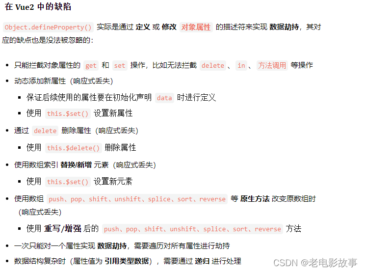

## Vue2和Vue3的区别

**渲染性能**：Vue3相对于Vue2来说在渲染性能上有所提升。Vue3通过使用**重写的响应系统和优化的虚拟DOM算法**,提供了更快的渲染性能。

**包体积**：Vue3相对于Vue2来说在包体积上更小。Vue3采用了一些新的构建方式（Webpack）和**Tree-Shaking技术**,使得生成的包更小。这减少了加载时间并提高了性能。

**Composition API** :Vue3引入了**Composition API,**它是一种基于函数的API风格,允许开发者根据逻辑组织代码。Composition API提供了更好的代码复用和组织方式,使得组件更加可读、可维护。

**TypeScript支持**：Vue3对TypeScript的支持进一步改进,提供了更好的类型推断和错误检查。这使得使用TypeScript开发Vue应用程序更加流畅。Vue3基于Ts编写

**响应式系统**：Vue3的响应式系统经过了重写,提供了更好的性能和更丰富的功能。它支持了跨层级的响应式数据传递、自定义的响应式触发器和批量更新等特性。

### 响应式的区别

- Vue2响应式：基于Object.defineProperty()实现的。

**defineProperty实际上是对象里面基本方法之一，而proxy是针对整个对象所有基本方法的拦截器。这是最本质的区别！！！！**

```js
//Vue2实现响应式
let v = obj.a // 拿到原始值
Object.defineProperty(obj, 'a', {
    get () { // 读的时候 运行get
        console.log('a', '读取')
        return v
    },
    set (val) { // 赋值的时候，运行set
        if (val !== v) {
            console.log('a', '更改')
            v = val
        }
    }
})
```

在vue2里面观察的方式就是深度遍历每一个属性，把每一个**属性的读取和赋值变成函数**，只要变成函数，就可以插一脚。

**缺陷**：由于它是针对每个属性的监听，所以他就必须要进行深度的遍历，这会有效率的损失。



- Vue3响应式：基于Proxy实现的。

```js
//Vue3代理实现响应式
const obj = {
    a: 1,
    b: 2,
    c: {
        a: 1,
        b: 2
    }
}
// 观察
new Proxy(obj, {
	get (target, k) { // 读的时候 运行get
		let v = target[k]
        console.log('k', '读取')
        return v
    },
    set (target, k, val) { // 赋值的时候，运行set
        if (target[k] !== val) {
            console.log('k', '更改')
            target[k] = val
        }
    },
    deleteProperty(){ // 删除属性监听
	
	}
})

proxy.a = 3
proxy.b
proxy.ccccccccc

```

// 总结： 深度监听，性能更好
// 可以监听 新增/删除 属性
// 可监听数组变化

// 能规避Object.definePropety的问题
// 缺陷： 无法兼容所有的浏览器，无法polyfill

## Diff算法

### 运行时机

当我们当前组件所依赖的数值**更新和组件创建**时运行**update**函数，update函数会调用组件的**render**函数，render生成**新的虚拟dom树**，update的到新虚拟dom树的根节点，然后进入update函数内部，将_vnode也就是旧虚拟dom树替换成新的虚拟dom树，然后用一个变量将旧虚拟dom树保存起来，接下来**调用patch函数进行diff比对**。

### 比对原则

**深度优先，同层比较**

1. 尽量不动
2. 能修改属性修改属性
3. 能移动dom移动dom
4. 实在不行再删除或新增真实dom

### 比对过程

1. 对比tag，标签名
2. 对比key（若存在）
3. 对比其它属性

### 子节点比对（子节点数组）

采用双指针遍历对比，首尾指针，依次以

头头->头尾->尾头->尾尾 比较

当start>end，则比对完毕

## 生命周期钩子（Vue2与Vue3）

### Vue2

beforeCreate

created

beforeMount

mounted

beforeUpdate

updated

beforeUnMounted

unMounted

beforeDestroy

destroyd

### Vue3

setup()//去掉beforeCreate和created,代替created

onBeforeMounted()

onMounted()

onBeforeUpdate()

onUpdated()

onBeforeUnmount()

onUnmounted()

//去掉了created和destroy