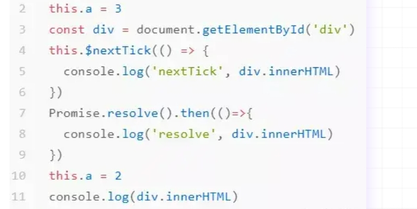

## Vue2和Vue3的区别

**渲染性能**：Vue3相对于Vue2来说在渲染性能上有所提升。Vue3通过使用**重写的响应系统和优化的虚拟DOM算法**,提供了更快的渲染性能。

**包体积**：Vue3相对于Vue2来说在包体积上更小。Vue3采用了一些新的构建方式（Webpack）和**Tree-Shaking技术**,使得生成的包更小。这减少了加载时间并提高了性能。

**Composition API** :Vue3引入了**Composition API,**它是一种基于函数的API风格,允许开发者根据逻辑组织代码。Composition API提供了更好的代码复用和组织方式,使得组件更加可读、可维护。

**TypeScript支持**：Vue3对TypeScript的支持进一步改进,提供了更好的类型推断和错误检查。这使得使用TypeScript开发Vue应用程序更加流畅。Vue3基于Ts编写

**响应式系统**：Vue3的响应式系统经过了重写,提供了更好的性能和更丰富的功能。它支持了跨层级的响应式数据传递、自定义的响应式触发器和批量更新等特性。

### 响应式的区别

- Vue2响应式：基于Object.defineProperty()实现的。

**defineProperty实际上是对象里面基本方法之一，而proxy是针对整个对象所有基本方法的拦截器。这是最本质的区别！！！！**

```js
//Vue2实现响应式
let v = obj.a // 拿到原始值
Object.defineProperty(obj, 'a', {
    get () { // 读的时候 运行get
        console.log('a', '读取')
        return v
    },
    set (val) { // 赋值的时候，运行set
        if (val !== v) {
            console.log('a', '更改')
            v = val
        }
    }
})
```

在vue2里面观察的方式就是深度遍历每一个属性，把每一个**属性的读取和赋值变成函数**，只要变成函数，就可以插一脚。

**缺陷**：由于它是针对每个属性的监听，所以他就必须要进行深度的遍历，这会有效率的损失。


- Vue3响应式：基于Proxy实现的。

```js
//Vue3代理实现响应式
const obj = {
    a: 1,
    b: 2,
    c: {
        a: 1,
        b: 2
    }
}
// 观察
new Proxy(obj, {
	get (target, k) { // 读的时候 运行get
		let v = target[k]
        console.log('k', '读取')
        return v
    },
    set (target, k, val) { // 赋值的时候，运行set
        if (target[k] !== val) {
            console.log('k', '更改')
            target[k] = val
        }
    },
    deleteProperty(){ // 删除属性监听
	
	}
})

proxy.a = 3
proxy.b
proxy.ccccccccc

```

// 总结： 深度监听，性能更好
// 可以监听 新增/删除 属性
// 可监听数组变化

// 能规避Object.definePropety的问题
// 缺陷： 无法兼容所有的浏览器，无法polyfill

## Diff算法

### 运行时机

当我们当前组件所依赖的数值**更新和组件创建**时运行**update**函数，update函数会调用组件的**render**函数，render生成**新的虚拟dom树**，update的到新虚拟dom树的根节点，然后进入update函数内部，将_vnode也就是旧虚拟dom树替换成新的虚拟dom树，然后用一个变量将旧虚拟dom树保存起来，接下来**调用patch函数进行diff比对**。

### 比对原则

**深度优先，同层比较**

1. 尽量不动
2. 能修改属性修改属性
3. 能移动dom移动dom
4. 实在不行再删除或新增真实dom

### 比对过程

1. 对比tag，标签名
2. 对比key（若存在）
3. 对比其它属性

### 子节点比对（子节点数组）

采用双指针遍历对比，首尾指针，依次以

头头->头尾->尾头->尾尾 比较

当start>end，则比对完毕

## 生命周期钩子（Vue2与Vue3）

### Vue2

beforeCreate

created

beforeMount

mounted

beforeUpdate

updated

beforeUnMounted

unMounted

beforeDestroy

destroyd

### Vue3

setup()//去掉beforeCreate和created,代替created

onBeforeMounted()

onMounted()

onBeforeUpdate()

onUpdated()

onBeforeUnmount()

onUnmounted()

//去掉了created和destroy

## 父子组件生命周期

父beforeCreate -> 父created -> 父beforeMount -> 子beforeCreate -> 子created -> 子beforeMount -> 子mounted -> 父mounted->父beforeUpdate->子beforeUpdate->子updated->父updated->父beforeDestroy->子beforeDestroy->子destroyed->父destroyed
即：父组件可以单独被create,在挂载前才会去看是否有子组件，其它生命周期则从内向外更新。

## 订阅发布模式和观察者模式

### 订阅发布模式

完成订阅发布流程需要三个角色：**订阅者，发布者，发布中心**

流程：订阅者需要向事件中心订阅指定的事件 -> 发布者向事件中心发布指定事件内容 -> 事件中心通知订阅者 -> 订阅者收到消息

代码实现，可以参考eventEmiter

常见场景：事件处理机制

**特点**：发布者和订阅者只关注事件本身，通过事件中心订阅/发布，不关注是谁发布/订阅，两者之间是**解耦**的

**优点**：发布者订阅者互相解耦，更加灵活

**缺点**：1.使用不当容易造成数据流混乱；2.需要维护事件队列，性能消耗大

### 观察者模式

完成观察者模式需要两个角色：**被观察者，观察者**

**观察者模式**定义了一种一对多的依赖关系，让多个**观察者**对象同时监听某一个目标对象，当这个目标对象的状态发生变化时，会通知所有**观察者**对象，使它们能够自动更新。

常见场景：vue2响应式，mobx响应式

代码实现(vue2响应式实现)

```js
/**
 * 观察监听一个对象成员的变化
 * @param {Object} obj 观察的对象
 * @param {String} targetVariable 观察的对象成员
 * @param {Function} callback 目标变化触发的回调
 */
function observer(obj, targetVariable, callback) {
  if (!obj.data) {
    obj.data = {}
  }
  Object.defineProperty(obj, targetVariable, {
    get() {
      return this.data[targetVariable]
    },
    set(val) {//状态改变
      this.data[targetVariable] = val
      // 目标主动通知观察者
      callback && callback(val)
    },
  })
  if (obj.data[targetVariable]) {
    callback && callback(obj.data[targetVariable])
  }
}
```

**特点**：观察者和被观察者是直接关联的，是耦合的

**优点**：便于实现响应式，目标资源的改变会通知使用者

**缺点**：两者相互耦合，使得这种方式不够灵活

## Vue.nextTick

### 作用

在下次 DOM 更新循环结束之后执行延迟回调。在修改数据之后立即使用这个方法，获取更新后的 DOM。

### 应用场景

列表数据更新之后，获取列表组件的高度

### 实现原理

nextTick内部动态维护一个**callbacks数组**，并将这个回调数组放到异步队列里面依次执行，根据不同的浏览器支持，异步的实现方式Promise.then > MutationObserver > setImmediate > setTimeout。

因此在标准浏览器中，nextTick通过Promise.resolve().then将回调数组放到微任务队列中执行

### Vue2中响应式数据改变，发生了什么

this.a = 2,触发了setter方法，通过dep.notify()，通知watcher更新视图，调用watcher.update()，采用queueWatcher去重，并将watcher.run放入nextTick**（nextTick(watcher.run)）**

### 代码输出案例



```js
//2
//nextTick 1
//resolve 2
```

第四行执行nextTick，将回调放置在callbacks数组并置入微任务队列，此时微队列：[...callbacks]

第七行将Promise回调置入微队列，此时微队列：[...callbacks,()=>{console.log(resolve)}]

第十行修改a，执行watcher.update，将watcher.run放入nextTick的callbacks

此时callbacks = [()=>{console.log(nextTick)},watcher.run]

微任务队列：[...callback,()=>{console.log(resolve)}]

## 为什么推荐使用ref而不用reactive

1.reative只支持引用类型，而ref支持基本数据类型和引用类型，引用类型内部也是用reactive实现

2。**重新分配新对象时，由于reactive返回的是Proxy对象引用，因此重新赋值对象会导致响应式丢失，而对ref.value重新赋值不会失去响应式**
