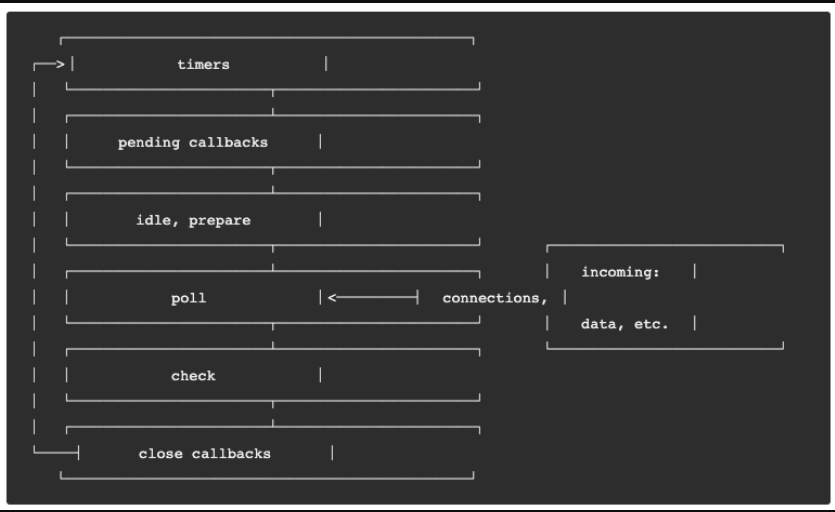
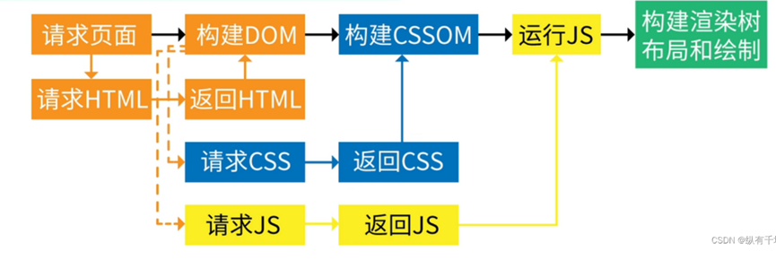
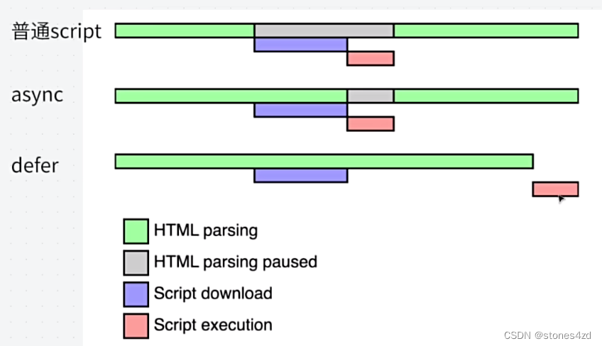
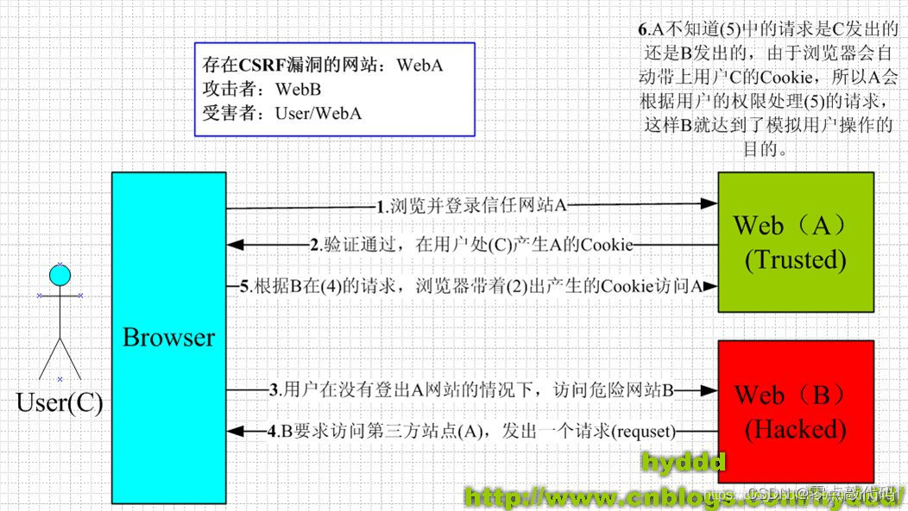
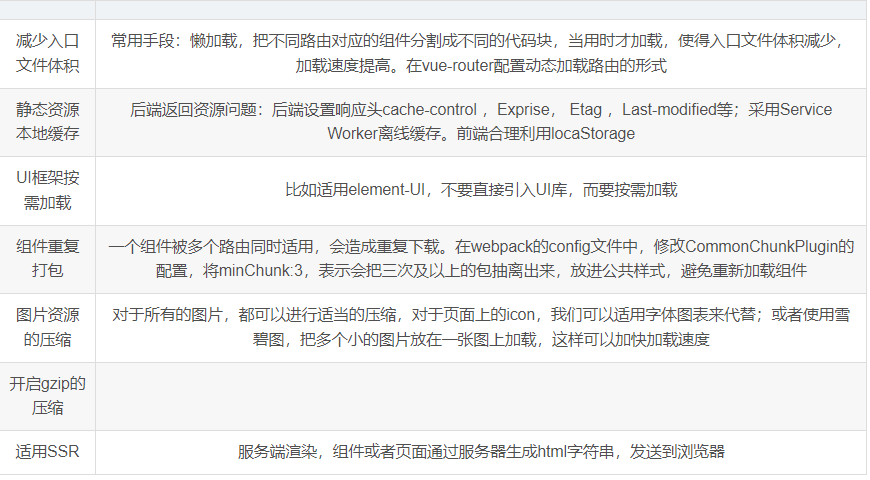

## 宏任务与微任务

**宏任务**：(macro)task，可以理解是每次执行栈执行的代码就是一个宏任务（包括每次从事件队列中获取一个事件回调并放到执行栈中执行），主要包括：script(整体代码)、setTimeout、setInterval、XMLHttpRequest.prototype.onload、I/O、UI 渲染。（由宿主发起的【Node/浏览器】）

**微任务**：微任务（microtask）是宏任务中的一个部分，它的执行时机是在同步代码执行之后，下一个宏任务执行之前。主要包括：Promise、MutationObserver。（由js发起的）

## 浏览器事件循环

l 所有同步任务都在主线程上执行（单线程），形成一个 “执行栈”（execution context stack）；

l 主线程之外，存在一个 “任务队列”（task queue），在走主流程的时候，如果碰到异步任务，那么就在 “任务队列” 中放置这个异步任务；

l 一旦 “执行栈” 中所有同步任务执行完毕，系统就会读取 “任务队列”，看看里面存在哪些事件。那些对应的异步任务，结束等待状态，进入执行栈，开始执行；

主线程不断重复上面三个步骤；

执行次序：同步代码->微任务代码->宏任务代码->宏任务代码中的下一个同步代码->下一个微任务代码->……循环

总结：执行宏任务，然后执行该宏任务产生的微任务，若微任务在执行过程中产生了新的微任务，则继续执行微任务，微任务执行完毕后，再回到宏任务中进行下一轮循环。

 **重点！！！**

并不是会清空所有宏任务队列的内容，而是每一个宏任务执行完后，都会去清空微任务队列，才去执行下一个宏任务。

## Nodejs的事件循环EventLoop详解

大体上和浏览器相同，但是多了一些Api

例如：IO操作，setImmediate()，process.nextTick

nodejs中，宏任务的执行也是分阶段的



```
1.timers: 执行setTimeout和setInterval的回调
2.pending callbacks: 执行延迟到下一个循环迭代的 I/O 回调
3.idle,prepare: 仅系统内部使用
4.poll: 检索新的 I/O 事件;执行与 I/O 相关的回调。事实上除了其他几个阶段处理的事情，其他几乎所有的异步都在这个阶段处理。
5.check: setImmediate在这里执行
6.close callbacks: 一些关闭的回调函数，如：socket.on('close', ...)
```

**重点来了！！！**

timers会将计时器到期的任务都放在这里面执行

poll是大部分的IO回调

check是Immediate的特殊执行时机

**由于**

process.nextTick(),属于微任务，并且执行时机又是所有微任务之前，因此，不管宏任务处于哪一个阶段，执行完一个任务之后，就马上执行nextTick

setImmediate被认为说是在下一次事件循环之前触发，但是执行顺序其实是遵循这个阶段的顺序

案例

```js
console.log('outer');
setTimeout(() => {
  //执行到这里，此时是timer阶段
  //js中setTimeout为0时，会被强制改为1ms,因此只能进入计时器线程，时间到了也只能进入下一个循环的timer
  setTimeout(() => {
    console.log('setTimeout');
  }, 0);
  //遇到setImmediate,因为本次循环的check阶段还没开始，所以进入check阶段
  setImmediate(() => {
    console.log('setImmediate');
  });
  //执行完timer阶段了，接下来 pending,idle,poll,check(所以输出setImmediate),close
}, 0);
//输出
//outer    setImmediate    setTimeout 
```

案例

```js
console.log('outer');
//此时同步代码执行完，刚要进入timer阶段
setTimeout(() => {
  console.log('setTimeout');
}, 0);//由于0会被改成1ms,所以当程序在进入timer阶段之前，经过了1ms,那么这个回调就会出现在timer,就比setImmediate先执行
//如果机器状态较好，进入timer前1ms还没到，那这个回调只能进入下一个循环的timer了，所以setImmediate就比较快
//放进去check阶段
setImmediate(() => {
  console.log('setImmediate');
});
//输出
//outer 有可能先setImmediate,也可能先setTimeout
```

**牢记！！！，setTimeout()的时间为0时，会被nodejs强制改成1，所以不是立即执行的**

## 浏览器事件循环和Nodejs事件循环的区别

浏览器：一个宏任务 ----->  清空微任务  ------>  下一个宏任务

nodejs: 一个阶段  --->  清空微任务  ----->  下一个阶段（一个阶段可能有多个宏任务，如timer有多个setTimeout回调，必须全部执行完，再执行微任务）

## 浏览器如何渲染页面

第一步构建DOM，第二步构建CSSOM，第三步构建渲染树，第四步布局，第五步绘制。如果构建DOM的时候遇到了JS，就请求下载执行JS。JS如果没有额外的设置，默认要等CSSOM构建完成。而JS既可以对DOM，也可以对CSSOM进行修改，这样后面的三步又会再运行一次。（DOM可以部分解析而CSS必须全部解析）

 

## 浏览器加载JS脚本

默认情况下，浏览器是**同步加载 JavaScript 脚本的**，即渲染引擎遇到`<script>`标签就会停下来，等到执行完脚本，再继续向下渲染。

问题：如果脚本很大，会导致浏览器渲染被阻塞很久，造成不好的体验

解决：提供了两种异步加载js脚本的方法：defer和async属性

script标签打开defer或async属性，脚本就会异步加载。渲染引擎遇到这一行命令，就会开始下载外部脚本，但不会等它下载和执行，而是直接执行后面的命令。


```html
 <script src="path/to/myModule.js" defer></script>
 <script src="path/to/myModule.js" async></script>
```

区别：

`defer`要等到整个页面在内存中正常渲染结束（DOM 结构完全生成，以及其他脚本执行完成），才会执行；

`async`一旦下载完，渲染引擎就会中断渲染，执行这个脚本以后，再继续渲染。

即:defer是渲染完执行，async是下载完就执行

## Script标签的defer和async属性



defer:异步加载js，等待dom树构建完成，再执行脚本，始终DOMContextLoaded之前执行，多个defer会顺序执行

async:异步加载异步执行，多个async不保证顺序执行，不保证在DOMContextLoaded之前执行

都只适用于外部脚本

## 从输入URL到呈现页面过程

输入url

缓存解析

域名解析（递归查找，迭代查找）

建立TCP连接（三次握手）

客户端发起请求

服务端接收请求并处理返回数据

关闭TCP连接（四次挥手）

浏览器渲染页面

## Web常见网络安全漏洞以及解决

### **XSS(跨站脚本攻击)**

通过文本输入注入恶意脚本，随输入提交到服务器，服务器保存脚本信息，当用户获取服务器数据时就会执行恶意脚本，侵害用户信息

**解决**：

1.将cookie等敏感信息设置为HttpOnly，不允许通过document，js获取cookie，防止恶意脚本获取用户登陆信息。

2.采用CSP内容安全策略，限制浏览器加载资源的类型和来源

3.输入检测过滤，内容转义

### **SQL注入**

当Web程序对数据输入没有做严格校验时，攻击者会在程序定义好的查询语句中插入恶意sql，实现任意查询，窃取数据。

```sql
eg:
SELECT * FROM user WHERE username='' and password=''//本来要查询的语句
SELECT * FROM user WHERE username='' and password='' OR '1'='1'//密码设置为' OR '1'='1
导致条件始终成立，绕过了密码验证
```

解决：

1.避免直接拼接sql语句，采用参数化查询

2.输入验证，拒绝非法字符输入  

3.最小权限原则，限制用户对数据库的访问权限

4.输入过滤

### **点击劫持**

攻击者使用一个多个的透明的iframe(嵌入式网页框架)覆盖在正常的网页上，诱导用户对该网页进行操作从而劫持用户的页面点击事件触发恶意回调或者进入恶意链接。

解决：X-Frame-Options(一个http响应头部)，专门用来预防iframe攻击，deny,sameorigin,allow-from.

### **CSRF** (Cross-site request forgery，**跨站请求伪造**)

也被称为One Click Attack或者Session Riding，通常缩写为CSRF或者XSRF，是一种对网站的恶意利用。尽管听起来像跨站脚本(XSS)，但它与XSS非常不同，XSS利用站点内的信任用户，而CSRF则通过伪装成受信任用户请求受信任的网站。



**攻击条件：**

- 登录受信任站点A，并在本地生成Cookie。
- 在不登出A的情况下，访问危急站点B。

**防御**：

1、验证码

验证码被认为是对抗CSRF攻击最简洁而有效的防御方法。

2、在请求地址中添加 token 并验证

可以在 HTTP 请求中以参数的形式加入一个随机产生的 token，并在服务器端建立一个拦截器来验证这token，如果请求中没有 token 或者 token 内容不正确，则认为可能是 CSRF 攻击而拒绝该请求。

3、在 HTTP 头中自定义属性并验证

这种方法也是使用 token 并进行验证，和上一种方法不同的是，这里并不是把 token 以参数的形式置于 HTTP 请求之中，而是把它放到 HTTP 头中自定义的属性里。

4、验证 HTTP Referer 字段

根据 HTTP 协议，在 HTTP 头中有一个字段叫Referer，它记录了该 HTTP 请求的来源地址。

## Token生成原理

使用JWT生成(json web token),jwt包含了头部，载荷和签名三部分，头部和载荷经过base64编码存放token类型，加密算法（头部），授权时间，有效期（载荷），再用算法对签名进行加密，三个部分拼接生成token。


## 跨域

### 什么是跨域

协议，域名，端口，任何一个不同都是跨域

### 为什么要跨域拦截

不进行跨域拦截很容易受到XSS,CSRF攻击

### 运行跨域的请求

img，link，script标签加载资源，以及表单提交是不受同源策略限制的

### 跨域了请求发出去了吗？

跨域并不是请求发送不出去，请求能发送产前样，服务端能收到请求并正常返回结果，只不过**结果被浏览器拦截了**

### 那为什么表单能够跨域发送请求，而 Ajax 却不能发送跨域请求

归根结底：**跨域是为了阻止用户读取到另一个域名下的内容**

而 Ajax 可以获取响应，但浏览器认为这不安全，所以拦截了响应

但是表单并不会获取新的内容，所以可以发起跨域请求。

### 解决跨域的方法

1.JSONP

利用scirpt标签的跨域特性，向服务器发起请求，服务器返回一段带参数的js代码，实现跨域加载资源

```html
//前端
<script type="text">
	const fn = (res)=>console.log(res);
</script>
<script src="http:abcd.com"></script>script>
//后端服务器 http:abcd.com返回字符串fn("我是传输数据")
```

优点：兼容性好

缺点：仅支持get请求，不安全易遭受XSS攻击(不支持Https)

2.CORS  "跨域资源共享"（Cross-origin resource sharing）

CORS 需要浏览器和服务器同时支持。但是目前基本上浏览器都支持，所以我们**只要保证服务器端服务器实现了 CORS 接口，就可以跨源通信**

后端：

| Name                             | Required | Comments                             |
| :------------------------------- | :------- | :----------------------------------- |
| Access-Control-Allow-Origin      | 必填     | 允许请求的域                         |
| Access-Control-Allow-Methods     | 必填     | 允许请求的方法                       |
| Access-Control-Allow-Headers     | 可选     | 预检请求后，告知发送请求需要有的头部 |
| Access-Control-Allow-Credentials | 可选     | 表示是否允许发送cookie，默认false；  |
| Access-Control-Max-Age           | 可选     | 本次预检的有效期，单位：秒；         |

3.postMessage()

对iframe跨域来说：H5提供了postMessage()的方法，可以在父子页面进行通信

4.使用Websocket通信

WebSocket和HTTP都是应用层协议，都基于 TCP 协议。但是 WebSocket 是一种双向通信协议，在建立连接之后，WebSocket 的 server 与 client 都能主动向对方发送或接收数据。同时，WebSocket 在建立连接时需要借助 HTTP 协议，连接建立好了之后 client 与 server 之间的双向通信就与 HTTP 无关了。

### WebSocket和HTTP的联系

>  **相同点：**
>
>  1. **都是基于tcp的，都是可靠性传输协议**
>  2. **都是应用层协议**

> **不同点：**
>
> 1. **WebSocket是双向通信协议，模拟Socket协议，可以<u>双向发送或接受信息</u>**
> 2. **HTTP是<u>单向</u>的**
> 3. **WebSocket是需要浏览器和服务器握手进行建立连接的**
> 4. **而http是浏览器发起向服务器的连接，服务器预先并不知道这个连接**，需要客户端主动发，服务端被动发，也就是一次请求，一次响应

## 前端缓存

### 分类(优先级高->优先级低)

#### Service Worker

Service Worker 借鉴了 Web Worker的 思路，即让 JS 运行在主线程之外，由于它脱离了浏览器的窗体，因此无法直接访问DOM。虽然如此，但它仍然能帮助我们完成很多有用的功能，比如离线缓存、消息推送和网络代理等功能。其中的离线缓存就是 Service Worker Cache。

浏览器调试窗口：Application->Cache Storage

#### Memory cache

内存缓存，几乎所有的网络请求资源都会被浏览器自动加入到 memory cache 中。而如果极端情况下 (例如一个页面的缓存就占用了超级多的内存)，那可能在 TAB 没关闭之前，排在前面的缓存就已经失效了。设置Cache:no-store不缓存，页面关闭缓存清除。

存取速度快，容量较小

#### disk cache

磁盘缓存，也叫Http缓存。磁盘缓存比内存缓存的存取速度慢。大文件一般都要放在磁盘缓存而不是内存缓存，通过请求头来指定

存取速度较慢，容量较大

**memory cache和disk cache统称强缓存**

### 浏览器请求一个静态资源的完整流程：

1. 调用 Service Worker 的 fetch 事件响应

2. 查看 memory cache

3. 查看 disk cache。这里又细分：

4. 如果有强制缓存且未失效，则使用强制缓存，不请求服务器。这时的状态码全部是 200

5. 如果有强制缓存但已失效，使用协商缓存，比较后确定 304 还是 200

6. 发送网络请求，等待网络响应

7. 把响应内容存入 disk cache (如果 HTTP 头信息配置可以存的话)

8. 把响应内容的引用存入 memory cache (无视 HTTP 头信息的配置)

9. 把响应内容存入 Service Worker 的 Cache Storage (如果 Service Worker 的脚本调用了 cache.put())
   


## 强缓存、协商缓存、CDN缓存

### CDN的概念（Content Delivery Network）

CDN（内容分发网络）通过一组位于全球各地的服务器，将网站的内容（例如图片、视频、网页文件等）从最靠近用户的服务器快速、可靠地发送给用户，从而提供快速、高效、低成本的内容传输服务。CDN系统通常由三个主要部分组成：分发服务系统，负载平衡系统，运营管理系统

### CDN的作用

1. 加速网站加载速度：CDN会将网站的图片、视频和其他静态资源缓存在离用户更近的服务器上，这样用户在访问网站时可以从附近的服务器获取这些内容，从而加快网站加载速度。
2. 减少网络延迟：由于用户能够从距离更近的服务器获取内容，CDN可以减少网络延迟，提高网站的响应速度，让用户能够更快地打开网页和浏览内容。
3. 减轻服务器负载：部分用户的访问请求会被分配给CDN的服务器处理，这样可以减轻原始服务器的负载压力，提高服务器的性能和稳定性。
4. 节省带宽成本：CDN可以减少网站跨地区传输的流量，降低网站的带宽成本，使网站运营更加经济高效。
5. 提高安全性：CDN还有助于提高网站的安全性，能够抵御一些网络攻击，例如通过监控异常流量来防御DDoS攻击，以及通过全链路HTTPS通信来防范中间人攻击。

### 加载流程

1. 用户向本地DNS服务器发起DNS请求解析域名
2. 配置了CDN的域名会解析出一个CName,DNS服务器将域名解析权交给CName指定的DNS域名服务器（重定向）
3. DNS解析域名，返回全局负载均衡设备的IP给浏览器
4. 浏览器向IP发起HTTP请求得到边缘节点的IP并与该节点通信取得内容

### 使用场景

1. **网站加速**：通过将**静态资源如图片、视频、样式表等放在CDN上**，用户可以从距离更近的CDN服务器获取这些资源，从而加快网页加载速度，改善用户体验。
2. **流媒体分发**：CDN可用于快速、可靠地传输视频、音频等大型媒体文件到全球各地的用户设备，确保用户可以流畅观看视频、听取音频。
3. 软件分发：对于大型软件或游戏的发布与更新，CDN能够快速地将软件分发到全球各地的用户，减少下载时间，加快软件更新的部署。

4. API请求加速：对于需要频繁请求后端API的网站和应用程序，CDN能够加速API的响应时间，提高系统的稳定性和性能。

5. 跨地区网络优化：对于跨地区的企业、服务提供商等，CDN能够优化全球网络传输，提高数据传输效率，降低网络延迟，改善数据传输质量。

6. 第三方CDN服务：开发者可以使用第三方CDN服务来加速其开源项目的网络传输和加载速度。
7. 直播传送：CDN也支持直播传送，通过在全球范围内部署服务器来提高访问速度，确保用户可以流畅观看直播内容。


### 强缓存

强缓存指的是在缓存有效期内，**不需要向服务器发送请求**，直接从缓存中读取资源。这意味着在缓存有效期内，浏览器直接使用缓存的资源，不会与服务器通信。

**好处**
减少服务器负载：减少了不必要的请求，服务器负载显著降低。
提高页面加载速度：资源直接从本地缓存中读取，减少了网络延迟，页面加载速度更快。
节省带宽：避免重复下载相同的资源，节省了带宽资源。
改善用户体验：快速的页面加载提高了用户满意度和留存率。
**如何开启**
强缓存主要通过 HTTP 响应头中的 **Expires** 和 **Cache-Control** 属性来实现。这些属性是由服务器在响应中设置的，并指示浏览器如何缓存资源。

expires记录有效时间，cache-control除了记录相对有效时间（xx秒）外，还可以记录其它信息（no-cache,no-store），cache-control的优先级更高

### 协商缓存

**概念**
协商缓存需要客户端和服务器之间的交互。当缓存资源过期时，客户端会向服务器发送请求，服务器根据请求头中的信息判断客户端缓存的资源是否仍然有效。命中返回304

**好处**
节省带宽：对于未修改的资源，服务器只返回状态码而不发送资源内容，节省了带宽。
减少延迟：即使需要与服务器通信，304 响应也比完全下载新的资源更快。
保持资源最新：确保浏览器使用的是最新版本的资源，提高了数据的一致性和可靠性。
平衡性能与新鲜度：在减少不必要请求的同时，确保资源的实时更新。
**如何开启**
协商缓存使用的主要属性是服务器返回的 **Last-Modified 和 ETag**，而在下次请求时会使用 If-Modified-Since 和 If-None-Match，它们的值在实现协商缓存时起着关键作用。

## 跨域时如何处理cookie

首先，在**服务端**设置响应头：

**Access-Control-Allow-Credentials: true**（将“允许跨域请求携带认证信息”的值设为true）

**Access-Control-Allow-Origin**: 请求域名（配置允许访问的域名）

接着，在客户端也要设置 **withCredential**s 使其允许 Cookie 共享，就可以实现 Cookie 的跨域访问了。

## iframe的缺点，弊端

1、加载速度慢，由于iframe需要加载嵌入的网页，因此会增加整体页面的加载时间；

2、对搜索引擎不友好，搜索引擎通常会忽略iframe中的内容，这意味着嵌入的网页的内容不会被搜索引擎索引；

3、安全性问题，恶意网站可以通过iframe来进行钓鱼、点击劫持等攻击，从而危害用户的隐私和安全；

4、兼容性问题，不同浏览器对iframe的支持程度不同等等。

总结：加载速度，SEO，网络安全，兼容性

## SessionStorage、LocalStorage、Cookies、Session的区别

### 作用域的区别

SessionStorage仅在当前会话期间有效，作用于窗口或标签页，不同窗口的SessionStorage不同

但是！！SessionStorage**在该标签或窗口打开一个新页面时会复制顶级浏览会话的上下文作为新会话的上文，也就是说A窗口有SessionStorage数据并且从A窗口通过window.open()或a标签跳转新页面时，会将A窗口的SessionStorage*<u>复制</u>*一份过去，但不是共享**

LocalStorage和Cookies作用于同一个域（协议、域名、端口），同一个域读取出相同的内容

Session也是会话级别

会话：用户打开一个浏览器，点击多个超链接，访问服务器多个web资源，然后关闭浏览器，整个过程为一个会话。

### 作用时间的区别

SessionStorage只存在于当前窗口的活跃时间，窗口关闭则消失（Session同）

LocalStorage存放在浏览器内存中且不删除则长期存在

Cookies默认同SessionStorage，与窗口同时存在，但是可以通过expires或max-age设置过期的时间，过期自动清除

### 存储位置的区别

Session是存储在服务器端的，其它都是客户端浏览器

###  传输数据

Cookie：每次请求都会携带 Cookie 数据，影响性能。
Session：仅在初始会话时传输 Session ID，后续请求不再携带全部会话数据。（当cookie被禁用时，可以使用url重写技术来传递sessionId）
LocalStorage：不随请求发送，仅在客户端存储和访问。
SessionStorage：不随请求发送，仅在客户端存储和访问。

## LocalStorage和indexedDB

### 同

遵守同源策略，不同域的存储资源不共享

### 异

LocalStorage存储空间限制：5MB-10MB

indexedDB存储空间限制：本地磁盘剩余空间的50%，也会由不同浏览器限制而不同。

### indexedDB

1. **键值型数据库**
2. 面向Javascript对象，允许存储复杂的结构体对象
3. 异步API，通常不是返回数据而是callback
4. 自带transition事务，所有操作都会绑定特殊的事务上

## SPA

### 概念

SPA是一种特殊的web应用。将**所有的活动局限于一个Web页面**中，仅在该Web页面初始化时加载相应的HTML、JavaScript和CSS。 一旦页面加载完成，SPA不会因为用户的操作而进行页面的重新加载或跳转。取而代之的是利用JavaScript动态的变换HTML的内容， 从而实现UI与用户的交互。

### 优点

1. 具有良好的交互体验
   因为是局部渲染，每个部分是单独的模块，避免了不必要的跳转和重复渲染。

2. 前后端分离，架构清晰

   

### 缺点

1. **可能出现首屏加载时间过长**

   因为SPA是将所有的活动局限于一个Web页面，需要在加载页面的时候将HTML、JavaScript和CSS统一加载，部分页面可以在需要的时候加载。这样会导致初次加载耗时多，可能出现首屏加载时间过长问题。

2. **不利于SEO（搜索引擎优化）**

   由于所有的内容都在一个页面中进行动态的替换，利用hash片段实现路由，而利用hash片段不会作为HTTP请求中的一部分发送给服务器，所以在SEO上存在弱势。

3. 导航不能用(现在有history模式，可以用)

   由于单页Web应用在一个页面中显示所有的内容，所以不能使用浏览器的前进后退功能，如果需要导航，需要自行设置前进后退。

### 解决首屏加载慢问题



## 浏览器内核

浏览器内核主要分为两部分：渲染引擎和js引擎。

### 渲染引擎

负责加载处理HTML,CSS构建DOM树，CSSOM树并结合组成渲染树，计算网页显示方式，组织页面元素回流重绘，渲染网页呈现到浏览器上来。

### js引擎

解析和执行javascript脚本来实现网页的动态效果。 

**不同内核对对网页的语法解释不同，所以渲染效果也可能不相同。**

### 常见内核

Trident:三叉戟内核，用于IE

Webkit:源码结构清晰，渲染速度极快，用于Safari,Chrome(早期)

Blink:在Webkit基础上修改优化,Chrome,Edge

Gecko:用于FireFox

## 前端监控

### 捕获网络异常错误

监听error事件

```js
//网络请求异常不会冒泡，必须设置在捕获阶段触发
window.addEventListener('error', function(e) {
  console.log('捕获', e)
}, true) // 这里只有捕获才能触发事件，冒泡是不能触发
```

### 捕获未处理的Promise错误

```js
window.addEventListener('unhandledrejection', function(e) {
  console.log('捕获为处理的Promise错误', e)
}) 
```

### 捕获JS同步错误

window.onerror

```js
window.onerror = function(message, source, lineno, colno, error) {
    console.log('捕获到异常：',{message, source, lineno, colno, error});
    return true;
}
```

## 前端性能指标

1. LCP(Largest Contentful Paint)最大内容绘制
2. INP(Interaction to Next Paint)下一次交互的绘制
3. CLS(Cumulative Layout Shift)累计布局偏移
4. TTFB(Time to First Byte)首字节加载时间
5. FCP(First Contentful Paint)首屏加载时间

## 前端预加载

### 概念

在确认用户会使用/浏览到某个资源时，提前对该静态资源进行加载，提高首屏加载速度，减少屏幕闪白的频率，优化用户体验

### 实现

1.prefetch

利用浏览器**空闲时间加载**资源并将其存储在缓存中，使用时在缓存获取
<head> 
    <!--低优先级预加载-->
    <link rel="prefetch" href="static/img/ticket_bg.a5bb7c33.png">
    <!--高优先级预加载-->
    <link rel="subresource" href="styles.css">
</head>

2.preload

声明当前页面的关键资源，**强制**浏览器**尽快**加载

<head>
    <link rel="preload" as="font" href="<%= require('/assets/fonts/AvenirNextLTPro-Demi.otf') %>" crossorigin>
    <link rel="preload" as="font" href="<%= require('/assets/fonts/AvenirNextLTPro-Regular.otf') %>" crossorigin> 
</head>

3.WebPack插件**preload-webpack-plugin**

```js
plugins: [
  new PreloadWebpackPlugin({
    rel: 'preload'，
    as(entry) {  //资源类型
      if (/\.css$/.test(entry)) return 'style';
      if (/\.woff$/.test(entry)) return 'font';
      if (/\.png$/.test(entry)) return 'image';
      return 'script';
    },
    include: 'asyncChunks', // preload模块范围，还可取值'initial'|'allChunks'|'allAssets',
    fileBlacklist: [/\.svg/] // 资源黑名单
    fileWhitelist: [/\.script/] // 资源白名单
  })
]
```

4.对WebPack异步加载的模块使用注释标记

```js
import(/* webpackPreload: true */ 'AsyncModule');
```

5.DNS预解析

```js
<link rel="dns-prefetch" href="//example.com">
```

6.图像预加载

```html

```

```js
<script src="./imagePreload.js"></script>
// imagePreload.js文件
var image= new Image()
image.src="https://xxx.xx.com/image.jpg";//提前加载图片
```
